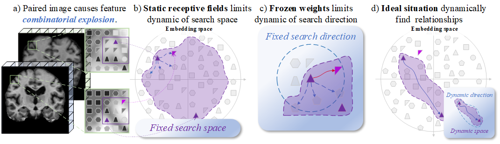
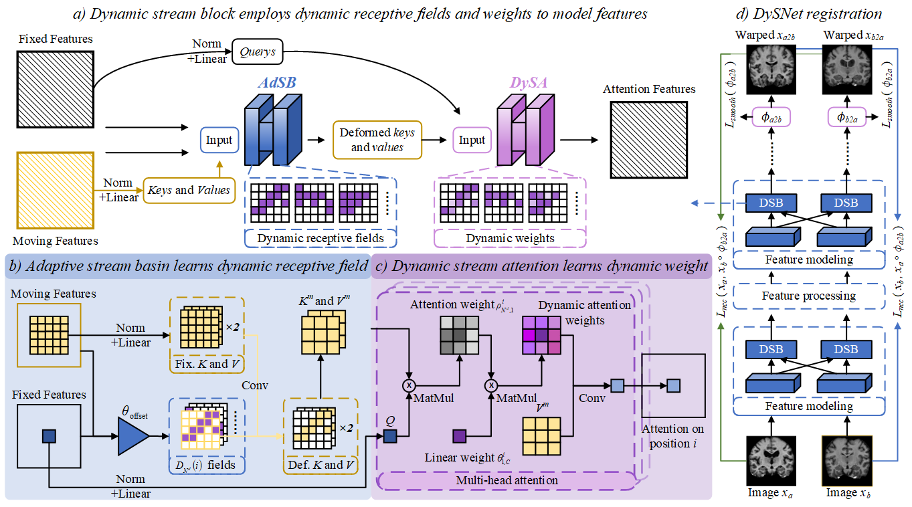

[](https://arxiv.org/abs/2512.19486)

---
[](https://arxiv.org/abs/2512.19486) 

**Dynamic Stream Network (DySNet)** is a novel dynamic modeling framework designed to tackle the **Combinatorial Explosion** challenge in Deformable Medical Image Registration (DMIR). By introducing dynamic receptive fields and weights, DySNet effectively eliminates interfering features and captures potential feature relationships. 

---
If you plan to try DySNet, we highly recommend that you start with the **2D version of DySNet-X**. This version can provide quick results.

---

> [**Dynamic Stream Network for Combinatorial Explosion Problem in Deformable Medical Image Registration**](https://arxiv.org/abs/2512.19486),
> [Shaochen Bi](mailto:bisc0507@163.com)$^{\dagger}$, [Yuting He](mailto:yuting.he4@case.edu)$^{\dagger\star}$, [Weiming Wang](mailto:wmwang@hkmu.edu.hk), [Hao Chen](mailto:jhc@ust.hk)$^{\star}$,
> **Accepted to: IEEE/CVF Conference on Computer Vision and Pattern Recognition (CVPR), 2026**

---

## ✨ Highlights

> **DySNet** — A modular dynamic modeling network that dynamically adjusts search spaces and directions through **Adaptive Stream Basin (AdSB)** and **Dynamic Stream Attention (DySA)** modules.

---

### 🌪️ 1. Tackling Combinatorial Explosion
In dual-input tasks like registration, the number of feature combinations grows exponentially with resolution. Static receptive fields often introduce irrelevant features. **DySNet** transforms static modeling into a "stream-like" dynamic process, significantly narrowing the search space.

<div align="center">
  
  <br>
  <em>From static to dynamic: DySNet narrows the search space and accurately locates feature correspondences.</em>
</div>

---

### 🌊 2. Adaptive Stream Basin (AdSB)
Inspired by how streams flow through a basin, **AdSB** predicts offsets to adjust the shape of the receptive field dynamically.
* **Deformable Receptive Fields**: Adaptively reshapes the sampling window based on anatomical structure differences.
* **Interference Elimination**: Filters out irrelevant feature combinations within the search space.

---

### 🎯 3. Dynamic Stream Attention (DySA)
Built upon the dynamic fields provided by AdSB, **DySA** introduces point-to-point attention mechanisms.
* **Dynamic Weights**: Calculates spatial weights in real-time based on feature similarity rather than fixed parameters.
* **Precise Alignment**: Adjusts search directions to capture the most accurate correspondences in the deformed space.

<div align="center">
  
  <br>
  <em>The DySNet Architecture: A symmetrical registration network built with Dynamic Stream Blocks (DSB).</em>
</div>

---

### 🧬 4. Versatility & Generalization
* **Plug-and-Play**: Modular design that integrates seamlessly into frameworks like Xmorpher and ModeT.
* **Multi-Dimensional**: Supports both **2D** and **3D** registration (Brain CT and MRI, Cardiac CT).
* **Robust Performance**: Achieves SOTA performance with significant gains in DSC across multiple benchmarks.

---

## 🛣️ Roadmap

| Status | Feature / Goal | Description |
|:------:|:----------------|:-------------|
| ✅ | **Core Architecture** | Development of the DSB-based dynamic feature modeling network |
| ✅ | **AdSB & DySA Modules** | Implementation of dynamic receptive fields and adaptive weights |
| ✅ | **Multi-Framework Integration** | Instantiation of DySNet-X (Xmorpher) and DySNet-M (ModeT) |
| ✅ | **Source Code Release** | Official PyTorch implementation has been released |
| 🔜 | **Pre-trained Weights** | Checkpoints for datasets |
| 💡 | **Memory Optimization** | Reducing GPU memory footprint for ultra-high-res 3D volumes |

---

## 💖 Acknowledgements
We thank the computational resources provided by **HKUST**. Thank collaborators for all the assistance provided for this project. We also thank the open-source community for providing the foundational frameworks that made DySNet possible. Special thanks to everyone who stars ⭐ this repository!

---

## 💡 Citation
If you find our work useful for your research, please cite our paper:

```bibtex
@article{bi2025dynamic,
  title={Dynamic Stream Network for Combinatorial Explosion Problem in Deformable Medical Image Registration},
  author={Bi, Shaochen and He, Yuting and Wang, Weiming and Chen, Hao},
  journal={arXiv preprint arXiv:2512.19486},
  year={2025}
}
